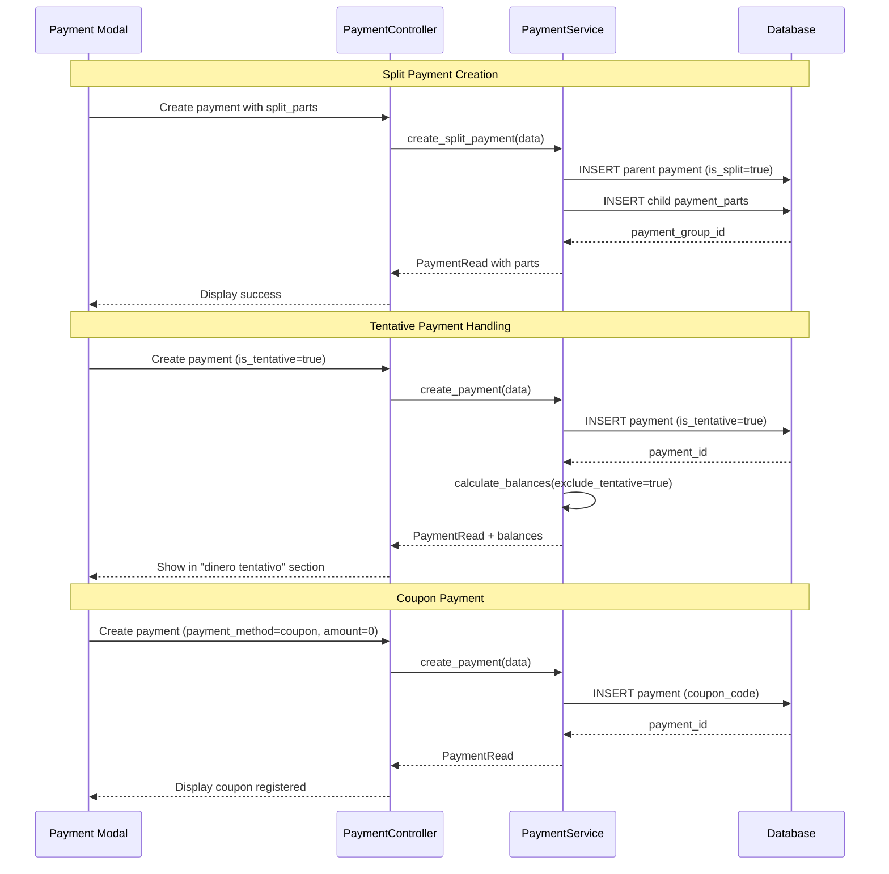

# Design Document: Payment Enhancements

## Overview

This design enhances the existing payment system with three major capabilities: split payments (allowing a single treatment payment to be divided into multiple partial payments), tentative/future payments (payments marked as tentative that don't count toward real balances until confirmed), and coupon/Groupon payments (zero-amount payments registered with coupon codes).


## Main Algorithm/Workflow



## Core Interfaces/Types

```python
# Enums
class PaymentMethod(str, Enum):
    CASH = "cash"
    CARD = "card"
    TRANSFER = "transfer"
    COUPON = "coupon"  # NEW
    OTHER = "other"

class PaymentStatus(str, Enum):  # NEW
    TENTATIVE = "tentative"
    EFFECTIVE = "effective"

# Database Models
class Payment(Base):
    __tablename__ = "payments"
    
    id: Mapped[int]
    amount: Mapped[float]
    payment_date: Mapped[date]
    payment_type: Mapped[PaymentType]
    payment_method: Mapped[PaymentMethod]
    recipient: Mapped[PaymentRecipient | None]
    
    # NEW: Split payment support
    is_split: Mapped[bool] = mapped_column(Boolean, default=False)
    payment_group_id: Mapped[str | None] = mapped_column(String(36), index=True)
    parent_payment_id: Mapped[int | None] = mapped_column(ForeignKey("payments.id"))
    
    # NEW: Tentative payment support
    is_tentative: Mapped[bool] = mapped_column(Boolean, default=False, index=True)
    confirmed_at: Mapped[datetime | None] = mapped_column(DateTime)
    
    # NEW: Coupon support
    coupon_code: Mapped[str | None] = mapped_column(String(100), index=True)
    
    # Existing fields
    client_id: Mapped[int | None]
    service_id: Mapped[int | None]
    appointment_id: Mapped[int | None]
    description: Mapped[str]
    notes: Mapped[str | None]
    reference_number: Mapped[str | None]
    created_at: Mapped[datetime]
    updated_at: Mapped[datetime]
    deleted_at: Mapped[datetime | None]
    
    # Relationships
    parent_payment: Mapped["Payment | None"] = relationship(
        "Payment", remote_side=[id], back_populates="child_parts"
    )
    child_parts: Mapped[list["Payment"]] = relationship(
        "Payment", back_populates="parent_payment"
    )

# Pydantic Schemas
class PaymentPartCreate(BaseModel):
    amount: float = Field(gt=0)
    payment_date: date
    payment_method: PaymentMethod
    description: str | None = None
    notes: str | None = None

class PaymentCreate(BaseModel):
    amount: float = Field(gt=0)
    payment_date: date
    payment_type: PaymentType
    payment_method: PaymentMethod
    recipient: PaymentRecipient | None = None
    
    # NEW fields
    is_split: bool = False
    split_parts: list[PaymentPartCreate] | None = None
    is_tentative: bool = False
    coupon_code: str | None = Field(default=None, max_length=100)
    
    # Existing fields
    client_id: int | None = None
    service_id: int | None = None
    appointment_id: int | None = None
    description: str | None = ""
    notes: str | None = None
    reference_number: str | None = None

class PaymentRead(BaseModel):
    id: int
    amount: float
    payment_date: date
    payment_type: PaymentType
    payment_method: PaymentMethod
    recipient: PaymentRecipient | None
    
    # NEW fields
    is_split: bool
    payment_group_id: str | None
    parent_payment_id: int | None
    is_tentative: bool
    confirmed_at: datetime | None
    coupon_code: str | None
    
    # Relationship data
    child_parts: list["PaymentRead"] = []
    
    # Existing fields
    client_id: int | None
    service_id: int | None
    appointment_id: int | None
    description: str
    notes: str | None
    reference_number: str | None
    created_at: datetime
    updated_at: datetime
    deleted_at: datetime | None
    client_name: str | None
    service_name: str | None
    appointment_date: date | None

class BalanceSummary(BaseModel):
    total_income: float
    total_expenses: float
    net: float
    tentative_income: float  # NEW
    tentative_expenses: float  # NEW
    tentative_net: float  # NEW
```

## Key Functions with Formal Specifications

### Function 1: create_split_payment()

```python
def create_split_payment(
    db: Session, 
    payload: PaymentCreate
) -> Payment
```

**Preconditions:**
- `payload.is_split` is `True`
- `payload.split_parts` is non-null and contains at least 2 parts
- Sum of `split_parts[i].amount` equals `payload.amount` (within 0.01 tolerance)
- All `split_parts[i].payment_date` are valid dates
- Database session `db` is active and valid

**Postconditions:**
- Returns parent `Payment` object with `is_split=True`
- Parent payment has unique `payment_group_id` (UUID)
- All child payments are created with same `payment_group_id`
- All child payments have `parent_payment_id` pointing to parent
- Sum of child payment amounts equals parent amount
- Transaction is committed or rolled back atomically

**Loop Invariants:** N/A (no loops in function body)

### Function 2: confirm_tentative_payment()

```python
def confirm_tentative_payment(
    db: Session, 
    payment_id: int
) -> Payment
```

**Preconditions:**
- `payment_id` exists in database
- Payment with `payment_id` has `is_tentative=True`
- Payment is not soft-deleted (`deleted_at` is NULL)
- Database session `db` is active

**Postconditions:**
- Payment `is_tentative` is set to `False`
- Payment `confirmed_at` is set to current UTC timestamp
- Payment `updated_at` is updated to current UTC timestamp
- Returns updated `Payment` object
- Balance calculations now include this payment

**Loop Invariants:** N/A

### Function 3: calculate_balances()

```python
def calculate_balances(
    db: Session,
    start_date: date | None = None,
    end_date: date | None = None,
    include_tentative: bool = False
) -> BalanceSummary
```

**Preconditions:**
- Database session `db` is active
- If `start_date` provided, it is a valid date
- If `end_date` provided, it is a valid date
- If both dates provided, `start_date <= end_date`

**Postconditions:**
- Returns `BalanceSummary` with all balance fields populated
- `total_income` includes only effective income payments (or all if `include_tentative=True`)
- `total_expenses` includes only effective expense payments (or all if `include_tentative=True`)
- `net = total_income - total_expenses`
- `tentative_income` includes only tentative income payments
- `tentative_expenses` includes only tentative expense payments
- `tentative_net = tentative_income - tentative_expenses`
- Split payment child parts are NOT double-counted (only parent is counted)
- Soft-deleted payments are excluded

**Loop Invariants:**
- For payment aggregation loop: All processed payments are valid and non-deleted
- Running totals remain consistent with payment types

### Function 4: validate_split_payment()

```python
def validate_split_payment(payload: PaymentCreate) -> tuple[bool, str | None]
```

**Preconditions:**
- `payload` is a valid `PaymentCreate` object
- `payload.is_split` is `True`

**Postconditions:**
- Returns `(True, None)` if validation passes
- Returns `(False, error_message)` if validation fails
- Validation checks:
  - `split_parts` is not None and has at least 2 parts
  - Sum of part amounts equals parent amount (within 0.01 tolerance)
  - All part amounts are positive
  - All part dates are valid
  - All part payment methods are valid enum values
- No side effects on input or database

**Loop Invariants:**
- For validation loop over split_parts: All previously checked parts are valid
- Running sum of amounts remains accurate

## Algorithmic Pseudocode

### Main Split Payment Creation Algorithm

```pascal
ALGORITHM create_split_payment(db, payload)
INPUT: db (database session), payload (PaymentCreate with is_split=true)
OUTPUT: parent_payment (Payment object)

BEGIN
  ASSERT payload.is_split = true
  ASSERT payload.split_parts IS NOT NULL
  ASSERT LENGTH(payload.split_parts) >= 2
  
  // Step 1: Validate split payment
  is_valid, error_msg ← validate_split_payment(payload)
  IF NOT is_valid THEN
    RAISE ValidationError(error_msg)
  END IF
  
  // Step 2: Generate unique payment group ID
  payment_group_id ← generate_uuid()
  
  // Step 3: Create parent payment
  parent_payment ← Payment(
    amount = payload.amount,
    payment_date = payload.payment_date,
    payment_type = payload.payment_type,
    payment_method = payload.payment_method,
    is_split = true,
    payment_group_id = payment_group_id,
    parent_payment_id = NULL,
    client_id = payload.client_id,
    service_id = payload.service_id,
    appointment_id = payload.appointment_id,
    description = payload.description,
    recipient = payload.recipient
  )
  
  db.add(parent_payment)
  db.flush()  // Get parent_payment.id
  
  ASSERT parent_payment.id IS NOT NULL
  
  // Step 4: Create child payment parts
  FOR each part IN payload.split_parts DO
    ASSERT part.amount > 0
    
    child_payment ← Payment(
      amount = part.amount,
      payment_date = part.payment_date,
      payment_type = payload.payment_type,
      payment_method = part.payment_method,
      is_split = false,
      payment_group_id = payment_group_id,
      parent_payment_id = parent_payment.id,
      client_id = payload.client_id,
      service_id = payload.service_id,
      appointment_id = payload.appointment_id,
      description = part.description OR payload.description,
      notes = part.notes,
      recipient = payload.recipient
    )
    
    db.add(child_payment)
  END FOR
  
  // Step 5: Commit transaction
  db.commit()
  db.refresh(parent_payment)
  
  ASSERT parent_payment.child_parts IS NOT NULL
  ASSERT LENGTH(parent_payment.child_parts) = LENGTH(payload.split_parts)
  
  RETURN parent_payment
END
```

**Preconditions:**
- `db` is an active database session
- `payload.is_split` is `true`
- `payload.split_parts` contains at least 2 valid parts
- Sum of split part amounts equals parent amount

**Postconditions:**
- Parent payment created with `is_split=true` and unique `payment_group_id`
- All child payments created with same `payment_group_id` and `parent_payment_id`
- Transaction committed successfully
- All payments persisted to database

**Loop Invariants:**
- All created child payments have same `payment_group_id`
- All created child payments have `parent_payment_id` pointing to parent
- Running sum of child amounts equals parent amount

### Tentative Payment Confirmation Algorithm

```pascal
ALGORITHM confirm_tentative_payment(db, payment_id)
INPUT: db (database session), payment_id (integer)
OUTPUT: payment (updated Payment object)

BEGIN
  // Step 1: Fetch payment
  payment ← db.query(Payment).filter(
    Payment.id = payment_id,
    Payment.deleted_at IS NULL
  ).first()
  
  IF payment IS NULL THEN
    RAISE NotFoundError("Payment not found")
  END IF
  
  // Step 2: Validate tentative status
  IF payment.is_tentative = false THEN
    RAISE ValidationError("Payment is already confirmed")
  END IF
  
  // Step 3: Update payment status
  payment.is_tentative ← false
  payment.confirmed_at ← current_utc_timestamp()
  payment.updated_at ← current_utc_timestamp()
  
  // Step 4: Commit changes
  db.commit()
  db.refresh(payment)
  
  ASSERT payment.is_tentative = false
  ASSERT payment.confirmed_at IS NOT NULL
  
  RETURN payment
END
```

**Preconditions:**
- `payment_id` exists in database
- Payment is not soft-deleted
- Payment has `is_tentative=true`

**Postconditions:**
- Payment `is_tentative` set to `false`
- Payment `confirmed_at` set to current timestamp
- Payment now included in effective balance calculations
- Changes persisted to database

**Loop Invariants:** N/A

### Balance Calculation Algorithm

```pascal
ALGORITHM calculate_balances(db, start_date, end_date, include_tentative)
INPUT: db (session), start_date (date or null), end_date (date or null), include_tentative (boolean)
OUTPUT: summary (BalanceSummary)

BEGIN
  // Initialize accumulators
  total_income ← 0.0
  total_expenses ← 0.0
  tentative_income ← 0.0
  tentative_expenses ← 0.0
  
  // Step 1: Build query filters
  query ← db.query(Payment).filter(Payment.deleted_at IS NULL)
  
  IF start_date IS NOT NULL THEN
    query ← query.filter(Payment.payment_date >= start_date)
  END IF
  
  IF end_date IS NOT NULL THEN
    query ← query.filter(Payment.payment_date <= end_date)
  END IF
  
  // Step 2: Exclude child payments (avoid double-counting splits)
  query ← query.filter(Payment.parent_payment_id IS NULL)
  
  // Step 3: Fetch all payments
  payments ← query.all()
  
  // Step 4: Aggregate balances
  FOR each payment IN payments DO
    ASSERT payment.deleted_at IS NULL
    ASSERT payment.parent_payment_id IS NULL
    
    IF payment.is_tentative = true THEN
      // Tentative payment
      IF payment.payment_type = "income" THEN
        tentative_income ← tentative_income + payment.amount
      ELSE
        tentative_expenses ← tentative_expenses + payment.amount
      END IF
    ELSE
      // Effective payment
      IF payment.payment_type = "income" THEN
        total_income ← total_income + payment.amount
      ELSE
        total_expenses ← total_expenses + payment.amount
      END IF
    END IF
  END FOR
  
  // Step 5: Calculate net balances
  net ← total_income - total_expenses
  tentative_net ← tentative_income - tentative_expenses
  
  // Step 6: Build summary
  summary ← BalanceSummary(
    total_income = total_income,
    total_expenses = total_expenses,
    net = net,
    tentative_income = tentative_income,
    tentative_expenses = tentative_expenses,
    tentative_net = tentative_net
  )
  
  RETURN summary
END
```

**Preconditions:**
- `db` is active database session
- If dates provided, `start_date <= end_date`

**Postconditions:**
- Returns complete `BalanceSummary` with all fields
- Effective balances exclude tentative payments
- Tentative balances include only tentative payments
- Split payment child parts not double-counted
- Soft-deleted payments excluded

**Loop Invariants:**
- All processed payments are non-deleted and non-child payments
- Running totals accurately reflect payment types and tentative status
- Balance calculations remain consistent throughout iteration

### Coupon Payment Validation Algorithm

```pascal
ALGORITHM validate_coupon_payment(payload)
INPUT: payload (PaymentCreate)
OUTPUT: is_valid (boolean), error_message (string or null)

BEGIN
  // Step 1: Check if payment method is coupon
  IF payload.payment_method ≠ "coupon" THEN
    RETURN (true, null)  // Not a coupon payment, skip validation
  END IF
  
  // Step 2: Validate amount is zero
  IF payload.amount ≠ 0.0 THEN
    RETURN (false, "Coupon payments must have amount = 0")
  END IF
  
  // Step 3: Validate coupon code is provided
  IF payload.coupon_code IS NULL OR LENGTH(payload.coupon_code) = 0 THEN
    RETURN (false, "Coupon code is required for coupon payments")
  END IF
  
  // Step 4: Validate coupon code format
  IF LENGTH(payload.coupon_code) > 100 THEN
    RETURN (false, "Coupon code must be 100 characters or less")
  END IF
  
  // All validations passed
  RETURN (true, null)
END
```

**Preconditions:**
- `payload` is a valid `PaymentCreate` object

**Postconditions:**
- Returns `(true, null)` if coupon payment is valid or not a coupon payment
- Returns `(false, error_message)` if coupon payment validation fails
- No side effects on input

**Loop Invariants:** N/A

## Example Usage

```python
# Example 1: Create split payment
split_payment_data = PaymentCreate(
    amount=300.00,
    payment_date=date(2024, 1, 15),
    payment_type=PaymentType.INCOME,
    payment_method=PaymentMethod.CASH,
    is_split=True,
    split_parts=[
        PaymentPartCreate(
            amount=100.00,
            payment_date=date(2024, 1, 15),
            payment_method=PaymentMethod.CASH,
            description="First installment"
        ),
        PaymentPartCreate(
            amount=100.00,
            payment_date=date(2024, 2, 15),
            payment_method=PaymentMethod.CARD,
            description="Second installment"
        ),
        PaymentPartCreate(
            amount=100.00,
            payment_date=date(2024, 3, 15),
            payment_method=PaymentMethod.TRANSFER,
            description="Final installment"
        )
    ],
    client_id=42,
    service_id=10,
    description="Micropigmentation treatment - 3 payments"
)

parent_payment = PaymentService.create_split_payment(db, split_payment_data)
# parent_payment.is_split == True
# parent_payment.payment_group_id == "550e8400-e29b-41d4-a716-446655440000"
# len(parent_payment.child_parts) == 3

# Example 2: Create tentative payment
tentative_payment_data = PaymentCreate(
    amount=150.00,
    payment_date=date(2024, 2, 1),
    payment_type=PaymentType.INCOME,
    payment_method=PaymentMethod.TRANSFER,
    is_tentative=True,
    client_id=42,
    service_id=10,
    description="Future appointment payment"
)

tentative_payment = PaymentService.create_payment(db, tentative_payment_data)
# tentative_payment.is_tentative == True
# tentative_payment.confirmed_at == None

# Get balances (excludes tentative by default)
balances = PaymentService.calculate_balances(db)
# balances.total_income does NOT include tentative_payment
# balances.tentative_income DOES include tentative_payment

# Confirm tentative payment later
confirmed_payment = PaymentService.confirm_tentative_payment(db, tentative_payment.id)
# confirmed_payment.is_tentative == False
# confirmed_payment.confirmed_at == datetime(2024, 1, 20, 10, 30, 0)

# Example 3: Create coupon payment
coupon_payment_data = PaymentCreate(
    amount=0.00,
    payment_date=date(2024, 1, 10),
    payment_type=PaymentType.INCOME,
    payment_method=PaymentMethod.COUPON,
    coupon_code="GROUPON-ABC123",
    client_id=42,
    service_id=10,
    description="Groupon redemption"
)

coupon_payment = PaymentService.create_payment(db, coupon_payment_data)
# coupon_payment.payment_method == PaymentMethod.COUPON
# coupon_payment.amount == 0.00
# coupon_payment.coupon_code == "GROUPON-ABC123"

# Example 4: Search payments with filters
search_response = PaymentService.search_payments(
    db,
    start_date=date(2024, 1, 1),
    end_date=date(2024, 1, 31),
    include_tentative=False  # Exclude tentative payments
)
# search_response.items contains only effective payments
# search_response.summary.total_income excludes tentative

# Example 5: Get split payment details
payment_with_parts = PaymentService.get_payment_by_id(db, parent_payment.id)
for part in payment_with_parts.child_parts:
    print(f"Part: €{part.amount} on {part.payment_date} via {part.payment_method}")
# Output:
# Part: €100.00 on 2024-01-15 via cash
# Part: €100.00 on 2024-02-15 via card
# Part: €100.00 on 2024-03-15 via transfer
```

## Correctness Properties

### Universal Quantification Statements

1. **Split Payment Integrity**
   - ∀ payment ∈ Payments: payment.is_split = true ⟹ (payment.payment_group_id ≠ null ∧ |payment.child_parts| ≥ 2)
   - ∀ payment ∈ Payments: payment.is_split = true ⟹ sum(child.amount for child in payment.child_parts) = payment.amount

2. **Tentative Payment Exclusion**
   - ∀ balance_calculation: include_tentative = false ⟹ (∀ payment ∈ included_payments: payment.is_tentative = false)
   - ∀ payment ∈ Payments: payment.is_tentative = false ⟹ payment.confirmed_at ≠ null

3. **Coupon Payment Constraints**
   - ∀ payment ∈ Payments: payment.payment_method = "coupon" ⟹ (payment.amount = 0 ∧ payment.coupon_code ≠ null)
   - ∀ payment ∈ Payments: payment.coupon_code ≠ null ⟹ payment.payment_method = "coupon"

4. **No Double-Counting**
   - ∀ balance_calculation: ∀ payment ∈ included_payments: payment.parent_payment_id = null
   - ∀ payment ∈ Payments: payment.parent_payment_id ≠ null ⟹ payment NOT IN balance_calculation

5. **Payment Group Consistency**
   - ∀ payment1, payment2 ∈ Payments: (payment1.payment_group_id = payment2.payment_group_id ∧ payment1.payment_group_id ≠ null) ⟹ (payment1.client_id = payment2.client_id ∧ payment1.service_id = payment2.service_id)

6. **Tentative Confirmation Monotonicity**
   - ∀ payment ∈ Payments: payment.confirmed_at ≠ null ⟹ payment.is_tentative = false
   - ∀ payment ∈ Payments: (payment.is_tentative = false ∧ payment.confirmed_at ≠ null) ⟹ payment.confirmed_at ≤ current_time

## Error Handling

### Error Scenario 1: Split Payment Amount Mismatch

**Condition:** Sum of split part amounts does not equal parent payment amount

**Response:** Raise `ValidationError` with message "Split payment parts sum (€X.XX) does not match parent amount (€Y.YY)"

**Recovery:** User must adjust split part amounts to match parent amount before retrying

### Error Scenario 2: Confirming Non-Tentative Payment

**Condition:** Attempting to confirm a payment that is already effective (`is_tentative=False`)

**Response:** Raise `ValidationError` with message "Payment is already confirmed"

**Recovery:** No action needed; payment is already in correct state

### Error Scenario 3: Coupon Payment with Non-Zero Amount

**Condition:** Creating coupon payment with `amount > 0`

**Response:** Raise `ValidationError` with message "Coupon payments must have amount = 0"

**Recovery:** User must set amount to 0 or change payment method

### Error Scenario 4: Missing Coupon Code

**Condition:** Creating coupon payment without `coupon_code`

**Response:** Raise `ValidationError` with message "Coupon code is required for coupon payments"

**Recovery:** User must provide valid coupon code

### Error Scenario 5: Insufficient Split Parts

**Condition:** Creating split payment with less than 2 parts

**Response:** Raise `ValidationError` with message "Split payment must have at least 2 parts"

**Recovery:** User must add more split parts or disable split payment

## Testing Strategy

### Unit Testing Approach

**Test Coverage Goals:** 90%+ code coverage for payment service and models

**Key Test Cases:**

1. **Split Payment Creation**
   - Test valid split payment with 2 parts
   - Test valid split payment with 5 parts
   - Test split payment with amount mismatch (should fail)
   - Test split payment with 1 part (should fail)
   - Test split payment with negative part amount (should fail)

2. **Tentative Payment Handling**
   - Test creating tentative payment
   - Test confirming tentative payment
   - Test balance calculation excludes tentative
   - Test balance calculation includes tentative when flag set
   - Test confirming already-confirmed payment (should fail)

3. **Coupon Payment Validation**
   - Test creating coupon payment with amount=0 and code
   - Test creating coupon payment with amount>0 (should fail)
   - Test creating coupon payment without code (should fail)
   - Test coupon code length validation

4. **Balance Calculations**
   - Test balance excludes child payments
   - Test balance excludes tentative payments
   - Test balance includes confirmed payments
   - Test balance with date range filters

### Property-Based Testing Approach

**Property Test Library:** Hypothesis (Python)

**Properties to Test:**

1. **Split Payment Sum Property**
   - Generate random parent amount and random split parts
   - Property: sum(parts) always equals parent amount (within tolerance)

2. **Balance Consistency Property**
   - Generate random set of payments (mix of tentative/effective)
   - Property: effective_balance + tentative_balance = total_balance

3. **No Double-Count Property**
   - Generate random split payments
   - Property: balance calculation never includes both parent and child

4. **Tentative Exclusion Property**
   - Generate random payments with tentative flag
   - Property: calculate_balances(include_tentative=False) never includes tentative payments

### Integration Testing Approach

**Integration Test Scenarios:**

1. **End-to-End Split Payment Flow**
   - Create split payment via API
   - Verify parent and child payments in database
   - Verify balance calculation excludes child payments
   - Verify UI displays split payment correctly

2. **Tentative to Effective Flow**
   - Create tentative payment via API
   - Verify balance excludes tentative
   - Confirm payment via API
   - Verify balance now includes payment

3. **Coupon Payment Flow**
   - Create coupon payment via API
   - Verify coupon code stored
   - Verify amount is 0
   - Verify payment appears in reports

## Performance Considerations

**Database Indexing:**
- Add index on `payment_group_id` for fast split payment queries
- Add index on `is_tentative` for fast balance calculations
- Add index on `coupon_code` for coupon lookup
- Add index on `parent_payment_id` for child payment queries

**Query Optimization:**
- Use `parent_payment_id IS NULL` filter in balance calculations to avoid N+1 queries
- Eager load `child_parts` relationship when fetching split payments
- Use database aggregation functions for balance calculations instead of Python loops

**Expected Performance:**
- Split payment creation: < 100ms for up to 10 parts
- Balance calculation: < 200ms for up to 10,000 payments
- Tentative payment confirmation: < 50ms

## Security Considerations

**Authorization:**
- Only authenticated admin users can create/modify payments
- Verify user has permission to access client/service data

**Input Validation:**
- Validate all amounts are non-negative (except parent split payment can be sum)
- Validate dates are not in far future (e.g., > 5 years)
- Sanitize coupon codes to prevent injection attacks
- Validate payment_method enum values

**Data Integrity:**
- Use database transactions for split payment creation (atomic)
- Prevent orphaned child payments with foreign key constraints
- Soft-delete payments instead of hard delete to maintain audit trail

## Frontend Design

### UI Components

#### 1. Enhanced Payment Modal

**New Fields:**
- Checkbox: "Split this payment into multiple parts"
- Checkbox: "Mark as tentative (future payment)"
- Payment Method dropdown: Add "Cupón/Groupon" option
- Conditional field: "Coupon Code" (shown when method = coupon)

**Split Payment Section (shown when split checkbox is checked):**
```html
<div id="split-payment-section" style="display: none;">
  <h4>Payment Parts</h4>
  <div id="split-parts-container">
    <!-- Dynamically added split part rows -->
  </div>
  <button type="button" id="add-split-part">+ Add Part</button>
  <div class="split-summary">
    <strong>Total: €<span id="split-total">0.00</span></strong>
    <span id="split-validation" class="error-text"></span>
  </div>
</div>
```

**Split Part Row Template:**
```html
<div class="split-part-row">
  <input type="number" class="split-amount" placeholder="Amount" step="0.01" min="0.01" required />
  <input type="date" class="split-date" required />
  <select class="split-method" required>
    <option value="cash">Efectivo</option>
    <option value="card">Tarjeta</option>
    <option value="transfer">Transferencia</option>
    <option value="coupon">Cupón</option>
  </select>
  <input type="text" class="split-description" placeholder="Description (optional)" />
  <button type="button" class="remove-split-part">✕</button>
</div>
```

#### 2. Balance Summary Cards Enhancement

**Current Cards:**
- Ingresos Totales
- Gastos Totales
- Neto

**New Cards:**
- Ingresos Tentativos (new, shown in different color)
- Gastos Tentativos (new, shown in different color)
- Neto Tentativo (new)

**Visual Design:**
- Tentative cards use dashed borders and lighter background
- Tooltip on hover: "Pagos futuros no confirmados"

#### 3. Payments Table Enhancements

**New Columns:**
- "Estado" column showing badges:
  - "Efectivo" (green badge)
  - "Tentativo" (yellow badge)
  - "Dividido" (blue badge with split icon)
  - "Cupón" (purple badge)

**Row Expansion for Split Payments:**
- Parent payment row has expand icon (▶)
- Clicking expands to show child payment parts
- Child rows are indented and styled differently

**Example:**
```
▼ 15/01/2024  Treatment payment  Service X  Client Y  Ingreso  Dividido  €300.00  [Actions]
  ├─ 15/01/2024  First installment  -  -  Efectivo  €100.00
  ├─ 15/02/2024  Second installment  -  -  Tarjeta  €100.00
  └─ 15/03/2024  Final installment  -  -  Transferencia  €100.00
```

#### 4. Filter Enhancements

**New Filter Options:**
- "Estado" dropdown:
  - Todos
  - Solo efectivos
  - Solo tentativos
  - Solo divididos
  - Solo cupones

### JavaScript Controller Changes

**PaymentsController Class Extensions:**

```javascript
class PaymentsController {
  constructor() {
    // ... existing code ...
    
    // New state
    this.splitParts = [];
    this.isSplitPayment = false;
    this.isTentative = false;
    
    // New DOM elements
    this.splitCheckbox = document.getElementById('split-payment-checkbox');
    this.tentativeCheckbox = document.getElementById('tentative-checkbox');
    this.splitSection = document.getElementById('split-payment-section');
    this.splitPartsContainer = document.getElementById('split-parts-container');
    this.couponCodeInput = document.getElementById('coupon-code-input');
    
    this.initSplitPaymentHandlers();
  }
  
  initSplitPaymentHandlers() {
    // Toggle split payment section
    this.splitCheckbox.addEventListener('change', (e) => {
      this.isSplitPayment = e.target.checked;
      this.splitSection.style.display = e.target.checked ? 'block' : 'none';
      if (e.target.checked && this.splitParts.length === 0) {
        this.addSplitPart();
        this.addSplitPart();
      }
    });
    
    // Add split part button
    document.getElementById('add-split-part').addEventListener('click', () => {
      this.addSplitPart();
    });
    
    // Payment method change handler (show/hide coupon code)
    document.getElementById('payment-method-select').addEventListener('change', (e) => {
      const isCoupon = e.target.value === 'coupon';
      this.couponCodeInput.style.display = isCoupon ? 'block' : 'none';
      if (isCoupon) {
        document.getElementById('payment-amount').value = '0.00';
        document.getElementById('payment-amount').readOnly = true;
      } else {
        document.getElementById('payment-amount').readOnly = false;
      }
    });
  }
  
  addSplitPart() {
    const partRow = document.createElement('div');
    partRow.className = 'split-part-row';
    partRow.innerHTML = `
      <input type="number" class="split-amount" placeholder="Amount" step="0.01" min="0.01" required />
      <input type="date" class="split-date" required />
      <select class="split-method" required>
        <option value="cash">Efectivo</option>
        <option value="card">Tarjeta</option>
        <option value="transfer">Transferencia</option>
        <option value="coupon">Cupón</option>
      </select>
      <input type="text" class="split-description" placeholder="Description (optional)" />
      <button type="button" class="remove-split-part">✕</button>
    `;
    
    // Remove button handler
    partRow.querySelector('.remove-split-part').addEventListener('click', () => {
      if (this.splitPartsContainer.children.length > 2) {
        partRow.remove();
        this.validateSplitTotal();
      } else {
        Toast.warning('Split payment must have at least 2 parts');
      }
    });
    
    // Amount change handler
    partRow.querySelector('.split-amount').addEventListener('input', () => {
      this.validateSplitTotal();
    });
    
    this.splitPartsContainer.appendChild(partRow);
    this.validateSplitTotal();
  }
  
  validateSplitTotal() {
    const parentAmount = parseFloat(document.getElementById('payment-amount').value) || 0;
    const partRows = this.splitPartsContainer.querySelectorAll('.split-part-row');
    
    let total = 0;
    partRows.forEach(row => {
      const amount = parseFloat(row.querySelector('.split-amount').value) || 0;
      total += amount;
    });
    
    document.getElementById('split-total').textContent = total.toFixed(2);
    
    const validationSpan = document.getElementById('split-validation');
    const diff = Math.abs(total - parentAmount);
    
    if (diff > 0.01) {
      validationSpan.textContent = `⚠ Difference: €${diff.toFixed(2)}`;
      validationSpan.style.color = '#ef4444';
      return false;
    } else {
      validationSpan.textContent = '✓ Amounts match';
      validationSpan.style.color = '#10b981';
      return true;
    }
  }
  
  collectSplitParts() {
    const parts = [];
    const partRows = this.splitPartsContainer.querySelectorAll('.split-part-row');
    
    partRows.forEach(row => {
      parts.push({
        amount: parseFloat(row.querySelector('.split-amount').value),
        payment_date: row.querySelector('.split-date').value,
        payment_method: row.querySelector('.split-method').value,
        description: row.querySelector('.split-description').value || null
      });
    });
    
    return parts;
  }
  
  async savePayment() {
    const form = document.getElementById('payment-form');
    const paymentId = document.getElementById('payment-id').value;
    
    // Validate split payment if enabled
    if (this.isSplitPayment && !this.validateSplitTotal()) {
      Toast.error('Split payment amounts must match total');
      return;
    }
    
    const paymentData = {
      amount: parseFloat(form.amount.value),
      payment_date: form.payment_date.value,
      payment_type: form.payment_type.value,
      payment_method: form.payment_method.value,
      recipient: form.recipient?.value || null,
      description: form.description.value || "",
      service_id: form.service_id?.value || null,
      client_id: form.client_id?.value || null,
      notes: form.notes.value || null,
      reference_number: form.reference_number.value || null,
      
      // NEW fields
      is_split: this.isSplitPayment,
      split_parts: this.isSplitPayment ? this.collectSplitParts() : null,
      is_tentative: document.getElementById('tentative-checkbox').checked,
      coupon_code: form.payment_method.value === 'coupon' ? form.coupon_code.value : null
    };
    
    Loading.show();
    try {
      if (paymentId) {
        await PaymentService.updatePayment(paymentId, paymentData);
        Toast.success('Pago actualizado correctamente');
      } else {
        await PaymentService.createPayment(paymentData);
        Toast.success('Pago creado correctamente');
      }
      
      this.paymentModal.hide();
      this.load(this.getFormFilters());
      this.updateCharts();
    } catch (error) {
      Toast.error('Error guardando pago: ' + error.message);
    } finally {
      Loading.hide();
    }
  }
  
  renderTable(payments) {
    this.tbody.innerHTML = '';
    
    payments.forEach(payment => {
      const row = this.createPaymentRow(payment);
      this.tbody.appendChild(row);
      
      // If split payment, add child rows
      if (payment.is_split && payment.child_parts && payment.child_parts.length > 0) {
        payment.child_parts.forEach(part => {
          const childRow = this.createChildPaymentRow(part);
          childRow.style.display = 'none'; // Hidden by default
          childRow.dataset.parentId = payment.id;
          this.tbody.appendChild(childRow);
        });
      }
    });
    
    // Add event listeners
    this.tbody.querySelectorAll('[data-edit]').forEach(btn => {
      btn.addEventListener('click', (e) => this.editPayment(e.target.dataset.edit));
    });
    
    this.tbody.querySelectorAll('[data-delete]').forEach(btn => {
      btn.addEventListener('click', (e) => this.deletePayment(e.target.dataset.delete));
    });
    
    this.tbody.querySelectorAll('[data-confirm]').forEach(btn => {
      btn.addEventListener('click', (e) => this.confirmTentativePayment(e.target.dataset.confirm));
    });
    
    this.tbody.querySelectorAll('.expand-split').forEach(btn => {
      btn.addEventListener('click', (e) => this.toggleSplitPaymentExpansion(e.target.dataset.paymentId));
    });
  }
  
  createPaymentRow(payment) {
    const row = document.createElement('tr');
    row.className = payment.payment_type === 'income' ? 'income-row' : 'expense-row';
    if (payment.is_tentative) row.classList.add('tentative-row');
    
    const statusBadges = [];
    if (payment.is_tentative) statusBadges.push('<span class="badge badge-warning">Tentativo</span>');
    if (payment.is_split) statusBadges.push('<span class="badge badge-info">Dividido</span>');
    if (payment.payment_method === 'coupon') statusBadges.push('<span class="badge badge-purple">Cupón</span>');
    if (!payment.is_tentative && !payment.is_split) statusBadges.push('<span class="badge badge-success">Efectivo</span>');
    
    const expandIcon = payment.is_split ? `<button class="expand-split" data-payment-id="${payment.id}">▶</button>` : '';
    
    const actions = payment.is_tentative 
      ? `<button class="btn btn-sm btn-success" data-confirm="${payment.id}">Confirmar</button>
         <button class="btn btn-sm btn-secondary" data-edit="${payment.id}">Editar</button>
         <button class="btn btn-sm btn-danger" data-delete="${payment.id}">Eliminar</button>`
      : `<button class="btn btn-sm btn-secondary" data-edit="${payment.id}">Editar</button>
         <button class="btn btn-sm btn-danger" data-delete="${payment.id}">Eliminar</button>`;
    
    row.innerHTML = `
      <td>${expandIcon}${new Date(payment.payment_date).toLocaleDateString('es-ES')}</td>
      <td>${payment.description}${payment.coupon_code ? ` (${payment.coupon_code})` : ''}</td>
      <td>${payment.service_name || '-'}</td>
      <td>${payment.client_name || '-'}</td>
      <td>
        <span class="badge ${payment.payment_type === 'income' ? 'badge-success' : 'badge-warning'}">
          ${payment.payment_type === 'income' ? 'Ingreso' : 'Gasto'}
        </span>
      </td>
      <td>
        <span class="badge badge-info">
          ${this.getPaymentMethodLabel(payment.payment_method)}
        </span>
      </td>
      <td>${statusBadges.join(' ')}</td>
      <td class="${payment.payment_type === 'income' ? 'text-success' : 'text-danger'}">
        ${payment.payment_type === 'income' ? '+' : '-'}€${payment.amount.toFixed(2)}
      </td>
      <td>${actions}</td>
    `;
    
    return row;
  }
  
  createChildPaymentRow(part) {
    const row = document.createElement('tr');
    row.className = 'child-payment-row';
    
    row.innerHTML = `
      <td style="padding-left: 2rem;">├─ ${new Date(part.payment_date).toLocaleDateString('es-ES')}</td>
      <td>${part.description || '-'}</td>
      <td>-</td>
      <td>-</td>
      <td>-</td>
      <td>
        <span class="badge badge-info">
          ${this.getPaymentMethodLabel(part.payment_method)}
        </span>
      </td>
      <td>-</td>
      <td>€${part.amount.toFixed(2)}</td>
      <td>-</td>
    `;
    
    return row;
  }
  
  toggleSplitPaymentExpansion(paymentId) {
    const childRows = this.tbody.querySelectorAll(`[data-parent-id="${paymentId}"]`);
    const expandBtn = this.tbody.querySelector(`.expand-split[data-payment-id="${paymentId}"]`);
    
    childRows.forEach(row => {
      row.style.display = row.style.display === 'none' ? 'table-row' : 'none';
    });
    
    expandBtn.textContent = expandBtn.textContent === '▶' ? '▼' : '▶';
  }
  
  async confirmTentativePayment(paymentId) {
    if (!confirm('¿Confirmar este pago tentativo?')) return;
    
    Loading.show();
    try {
      await PaymentService.confirmTentativePayment(paymentId);
      Toast.success('Pago confirmado correctamente');
      this.load(this.getFormFilters());
      this.updateCharts();
    } catch (error) {
      Toast.error('Error confirmando pago');
    } finally {
      Loading.hide();
    }
  }
  
  updateCards(summary) {
    // Existing cards
    this.incomeCard.textContent = `€${summary.total_income.toFixed(2)}`;
    this.expenseCard.textContent = `€${summary.total_expenses.toFixed(2)}`;
    this.netCard.textContent = `€${summary.net.toFixed(2)}`;
    this.netCard.parentElement.className = `summary-card ${summary.net >= 0 ? 'net-positive' : 'net-negative'}`;
    
    // NEW: Tentative cards
    document.getElementById('tentative-income').textContent = `€${summary.tentative_income.toFixed(2)}`;
    document.getElementById('tentative-expenses').textContent = `€${summary.tentative_expenses.toFixed(2)}`;
    document.getElementById('tentative-net').textContent = `€${summary.tentative_net.toFixed(2)}`;
  }
}
```

### CSS Styling

```css
/* Split payment section */
#split-payment-section {
  border: 1px solid #e5e7eb;
  border-radius: 8px;
  padding: 1rem;
  margin-top: 1rem;
  background: #f9fafb;
}

.split-part-row {
  display: grid;
  grid-template-columns: 1fr 1fr 1.5fr 2fr auto;
  gap: 0.5rem;
  margin-bottom: 0.5rem;
  align-items: center;
}

.split-summary {
  margin-top: 1rem;
  padding-top: 1rem;
  border-top: 2px solid #d1d5db;
  display: flex;
  justify-content: space-between;
  align-items: center;
}

/* Tentative payment cards */
.summary-card.tentative {
  border: 2px dashed #f59e0b;
  background: #fffbeb;
}

/* Child payment rows */
.child-payment-row {
  background: #f9fafb;
  font-size: 0.9em;
  color: #6b7280;
}

/* Tentative payment rows */
.tentative-row {
  background: #fffbeb;
  border-left: 3px solid #f59e0b;
}

/* Badge colors */
.badge-purple {
  background: #8b5cf6;
  color: white;
}

/* Expand button */
.expand-split {
  background: none;
  border: none;
  cursor: pointer;
  font-size: 0.8em;
  padding: 0.25rem;
  margin-right: 0.5rem;
}
```

## Dependencies

**Backend:**
- SQLAlchemy 2.x (ORM)
- Pydantic 2.x (validation)
- FastAPI (web framework)
- Python 3.11+

**Database:**
- SQLite (existing)
- Migration tool: Alembic or raw SQL

**Frontend:**
- Vanilla JavaScript (existing)
- Chart.js (existing, for visualizations)
- No new dependencies required

**New Python Packages:**
- `uuid` (standard library, for payment_group_id generation)
- No additional external packages needed
